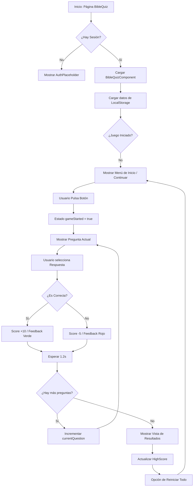

# Juan Rey 4C - Utilities & Portfolio

  

  <h1>🚀 Juan Rey 4C - Digital Utilities & Professional Portfolio</h1>

  

    <strong>Una plataforma moderna y reactiva diseñada para centralizar herramientas útiles y mostrar proyectos personales.</strong>
  

  

---

## 🌟 Sobre la Plataforma

**Juan Rey 4C** es un ecosistema digital que combina un portafolio profesional con una serie de herramientas prácticas de uso diario. El objetivo principal es ofrecer una experiencia de usuario fluida, rápida y estéticamente atractiva, integrando funcionalidades que van desde el filtrado de contenido hasta la gestión administrativa.

### 🛠️ Herramientas Principales

*   **🔍 YouTube Filter**: Una herramienta especializada diseñada para filtrar y organizar contenido de YouTube, permitiendo una navegación más enfocada y personalizada.
*   **📝 Libreta de Notas**: Un sistema de notas integrado para capturar ideas, recordatorios o fragmentos de código de forma rápida y sencilla.
*   **📊 Súper Panel (Admin)**: Un panel de administración avanzado para la gestión de usuarios, control de planes (PRO/Gratis) y comunicación directa vía email.
*   **📖 Bible Quiz**: Un juego interactivo de preguntas y respuestas bíblicas con sistema de puntuación, persistencia de progreso y récords personales.

---

## 📖 Módulo Bible Quiz

El **Bible Quiz** es un componente interactivo diseñado para poner a prueba el conocimiento bíblico de los usuarios.

### 🧠 Lógica de Funcionamiento

La lógica está centralizada en el componente `BibleQuizComponent` y se basa en un flujo de estados reactivos:

1.  **Inicialización**: El componente lee el `localStorage` para recuperar el progreso previo (`gameStarted`, `score`, `currentQuestion`) y el puntaje máximo (`highScore`).
2.  **Validación de Respuesta**: Al seleccionar una opción:
    *   **Acierto**: Suma 10 puntos y muestra feedback visual (verde).
    *   **Error**: Resta 5 puntos y muestra feedback visual (rojo).
3.  **Transición**: Existe un retraso de 1.2 segundos tras cada respuesta para que el usuario procese el feedback antes de pasar automáticamente a la siguiente pregunta.
4.  **Finalización**: Al completar el set de preguntas, se muestra una vista de resultados con el puntaje final y la opción de reiniciar, actualizando el `highScore` si es necesario.

### 📊 Diagrama de Flujo (Mermaid)

---

## 💻 Descripción Técnica

Esta aplicación ha sido construida siguiendo los más altos estándares de desarrollo web moderno, priorizando el rendimiento, la escalabilidad y la experiencia del desarrollador.

### 🚀 Stack Tecnológico

*   **Framework**: [Next.js 16](https://nextjs.org/) (App Router) para una renderización híbrida ultra rápida.
*   **Lenguaje**: [TypeScript](https://www.typescriptlang.org/) para un desarrollo robusto y tipado.
*   **Estilos**: [Tailwind CSS 4](https://tailwindcss.com/) y [DaisyUI 5](https://daisyui.com/) para una interfaz moderna y componentes pre-estilizados de alta fidelidad.
*   **Base de Datos**: [Vercel Postgres](https://vercel.com/docs/storage/vercel-postgres) (Serverless SQL).
*   **ORM**: [Drizzle ORM](https://orm.drizzle.team/) para una interacción con la base de datos segura y eficiente.
*   **Autenticación**: [NextAuth.js](https://next-auth.js.org/) con integración de Google OAuth.
*   **Comunicaciones**: [Nodemailer](https://nodemailer.com/) para el sistema de notificaciones y gestión de correos electrónicos.
*   **Analíticas**: Integración nativa con Vercel Analytics y Speed Insights para monitoreo continuo.

---

  Desarrollado con ❤️ por Juan Rey

